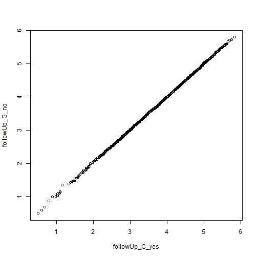
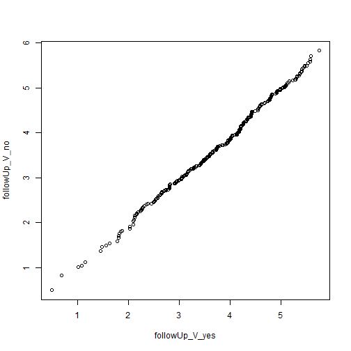

```r
devtools::load_all(".")
library(dplyr)
```

Load raw data. At this point we are not authorized to make raw data publicly available. `FinPrisonMales.rds` includes only males.

Update data file in "/not_public"


```r
rm(list = ls())
devtools::wd()
FinPrisonMales <- 
  readRDS("not_public/FinPrisonData.rds") %>% 
  filter(gender == "male")

stopifnot(sum(FinPrisonMales$gender == "male") == nrow(FinPrisonMales))
```

We define a violent crime as crimes that belong to the homicide or assault categories. Other offence categories include offences that are violent and offences that are not violent. In many cases the violent forms are also coded as assault. 

We create variables for new violent crime 


```r
analyzed_data <- 
  FinPrisonMales %>% 
  mutate(
    newO_violent = as.factor(
      ifelse(newO_homicide == 1 | newO_assault == 1,
             "new_violent_crime",
             "no_crime_or_not_violent")
      ),
    newO_violent = relevel(newO_violent, ref = "no_crime_or_not_violent")
    )


table(analyzed_data$newO_violent)
```

```
## 
## no_crime_or_not_violent       new_violent_crime 
##                    1218                     278
```

```r
table(analyzed_data$newO_violent)/nrow(analyzed_data)
```

```
## 
## no_crime_or_not_violent       new_violent_crime 
##               0.8141711               0.1858289
```

Of the 748 new convictions 278 are categorized as prison terms for violent crimes.

For descriptive statistics we also want a variable that represents category of reoffending as a single variable with levels "no reoffence", "non-violent reoffence", and "violent reoffence".


```r
# Get indices
no_reoff_i      <- 
  which(analyzed_data$reoffenceThisTerm == "not_in_prison")

non_vio_reoff_i <- 
  which(analyzed_data$reoffenceThisTerm == "new_prison_sentence" &
          analyzed_data$newO_violent    == "no_crime_or_not_violent")

vio_reoff_i     <-
  which(analyzed_data$newO_violent      == "new_violent_crime")

# Assert that all rows are accounted for
assertthat::assert_that(
  identical(
    sort(c(no_reoff_i, non_vio_reoff_i, vio_reoff_i)),
    1:nrow(analyzed_data)))
```

```
## [1] TRUE
```

```r
analyzed_data$reoff_category[no_reoff_i]      <- "no_reoffence"
analyzed_data$reoff_category[non_vio_reoff_i] <- "reoffence_nonviolent"
analyzed_data$reoff_category[vio_reoff_i]     <- "reoffence_violent"

analyzed_data$reoff_category <- factor(analyzed_data$reoff_category)

summary(analyzed_data$reoff_category)
```

```
##         no_reoffence reoffence_nonviolent    reoffence_violent 
##                  748                  470                  278
```


# Check follow-up time

Compare distributions in follow-up time between those who committed a new crime and those who did not.


```r
followUp_G_yes <- analyzed_data[
  analyzed_data$reoffenceThisTerm == "new_prison_sentence",
  "followUpYears"]

followUp_G_no <- analyzed_data[
  analyzed_data$reoffenceThisTerm == "not_in_prison",
  "followUpYears"]

followUp_V_yes <- analyzed_data[
  analyzed_data$newO_violent == "new_violent_crime",
  "followUpYears"]

followUp_V_no <- analyzed_data[
  analyzed_data$newO_violent == "no_crime_or_not_violent",
  "followUpYears"]
  
  
qqplot(followUp_G_yes, followUp_G_no)
```



```r
qqplot(followUp_V_yes, followUp_V_no)
```



The similarity of distributions is close to perfect for general recidivism and very good for violent recidivism.

Check means and standard deviations


```r
analyzed_data %>% 
  group_by(reoffenceThisTerm) %>% 
  summarise(M = mean(followUpYears),
            SD = sd(followUpYears))
```

```
## # A tibble: 2 x 3
##   reoffenceThisTerm       M    SD
##   <fct>               <dbl> <dbl>
## 1 not_in_prison        3.66  1.04
## 2 new_prison_sentence  3.65  1.05
```

```r
analyzed_data %>% 
  group_by(newO_violent) %>% 
  summarise(M = mean(followUpYears),
            SD = sd(followUpYears))
```

```
## # A tibble: 2 x 3
##   newO_violent                M    SD
##   <fct>                   <dbl> <dbl>
## 1 no_crime_or_not_violent  3.65  1.04
## 2 new_violent_crime        3.70  1.05
```

# Time to offence


```r
median(analyzed_data$daysToNewO, na.rm = TRUE) 
```

```
## [1] 101.8333
```

```r
max(analyzed_data$daysToNewO, na.rm = TRUE) 
```

```
## [1] 1321
```

```r
sum(analyzed_data$daysToNewO <= 365, na.rm = TRUE) /748
```

```
## [1] 0.8395722
```

```r
# Proportion under 1 year
median(analyzed_data$followUpYears)
```

```
## [1] 3.687886
```

```r
min(analyzed_data$followUpYears)
```

```
## [1] 0.4928142
```

```r
max(analyzed_data$followUpYears)
```

```
## [1] 5.828885
```


# Split data into a training set and a test set


```r
# set.seed(3010)
# four_folds   <- caret::createFolds(y = analyzed_data$reoffenceThisTerm, k = 4)
# 
# training_set <- analyzed_data[!(1:nrow(analyzed_data) %in% four_folds[[4]]), ]
# test_set     <- analyzed_data[ (1:nrow(analyzed_data) %in% four_folds[[4]]), ]

# Sample 300 indexes (20 %) to be included in the test set. The test set will be
# 300 observations and the training set can be devided into 4 equally big folds
# of 299 observations.

set.seed(100918)
test_set_index <- sample(x = 1:nrow(analyzed_data), 300)

training_set <- analyzed_data[!(1:nrow(analyzed_data) %in% test_set_index), ]
test_set     <- analyzed_data[ (1:nrow(analyzed_data) %in% test_set_index), ]

nrow(training_set)
```

```
## [1] 1196
```

```r
nrow(test_set)
```

```
## [1] 300
```


# Save data for later use. 
Will not be made public.

```r
devtools::wd()
saveRDS(analyzed_data, "not_public/analyzed_data.rds")
saveRDS(training_set,  "not_public/training_set.rds")
saveRDS(test_set,      "not_public/test_set.rds")
```

Display session info.

```r
sessionInfo()
```

```
## R version 3.5.2 (2018-12-20)
## Platform: x86_64-w64-mingw32/x64 (64-bit)
## Running under: Windows >= 8 x64 (build 9200)
## 
## Matrix products: default
## 
## locale:
## [1] LC_COLLATE=Swedish_Finland.1252  LC_CTYPE=Swedish_Finland.1252   
## [3] LC_MONETARY=Swedish_Finland.1252 LC_NUMERIC=C                    
## [5] LC_TIME=Swedish_Finland.1252    
## 
## attached base packages:
## [1] stats     graphics  grDevices utils     datasets  methods   base     
## 
## other attached packages:
##  [1] recidivismsl_0.0.0.9000 assertthat_0.2.0       
##  [3] caret_6.0-81            lattice_0.20-38        
##  [5] bindrcpp_0.2.2          ggplot2_3.1.0          
##  [7] dplyr_0.7.8             testthat_2.0.1         
##  [9] purrr_0.2.5             magrittr_1.5           
## 
## loaded via a namespace (and not attached):
##  [1] nlme_3.1-137            fs_1.2.6               
##  [3] xopen_1.0.0             usethis_1.4.0          
##  [5] lubridate_1.7.4         devtools_2.0.1         
##  [7] rprojroot_1.3-2         tools_3.5.2            
##  [9] backports_1.1.3         utf8_1.1.4             
## [11] R6_2.3.0                rpart_4.1-13           
## [13] lazyeval_0.2.1          colorspace_1.4-0       
## [15] nnet_7.3-12             withr_2.1.2            
## [17] ResourceSelection_0.3-4 tidyselect_0.2.5       
## [19] prettyunits_1.0.2       processx_3.2.1         
## [21] compiler_3.5.2          glmnet_2.0-16          
## [23] cli_1.0.1               xml2_1.2.0             
## [25] desc_1.2.0              scales_1.0.0           
## [27] randomForest_4.6-14     readr_1.3.1            
## [29] callr_3.1.1             commonmark_1.7         
## [31] stringr_1.3.1           digest_0.6.18          
## [33] pkgconfig_2.0.2         sessioninfo_1.1.1      
## [35] highr_0.7               rlang_0.3.1            
## [37] ggthemes_4.0.1          rstudioapi_0.9.0       
## [39] bindr_0.1.1             generics_0.0.2         
## [41] ModelMetrics_1.2.2      Matrix_1.2-15          
## [43] Rcpp_1.0.0              munsell_0.5.0          
## [45] fansi_0.4.0             furniture_1.8.7        
## [47] stringi_1.2.4           pROC_1.13.0            
## [49] yaml_2.2.0              MASS_7.3-51.1          
## [51] pkgbuild_1.0.2          plyr_1.8.4             
## [53] recipes_0.1.4           grid_3.5.2             
## [55] forcats_0.3.0           crayon_1.3.4           
## [57] splines_3.5.2           hms_0.4.2              
## [59] knitr_1.21              ps_1.3.0               
## [61] pillar_1.3.1            reshape2_1.4.3         
## [63] codetools_0.2-15        clisymbols_1.2.0       
## [65] stats4_3.5.2            pkgload_1.0.2          
## [67] glue_1.3.0              evaluate_0.12          
## [69] data.table_1.12.0       remotes_2.0.2          
## [71] foreach_1.4.4           gtable_0.2.0           
## [73] rcmdcheck_1.3.2         tidyr_0.8.2            
## [75] xfun_0.4                gower_0.1.2            
## [77] prodlim_2018.04.18      roxygen2_6.1.1         
## [79] class_7.3-14            survival_2.43-3        
## [81] timeDate_3043.102       tibble_2.0.1           
## [83] iterators_1.0.10        memoise_1.1.0          
## [85] lava_1.6.4              ipred_0.9-8
```


