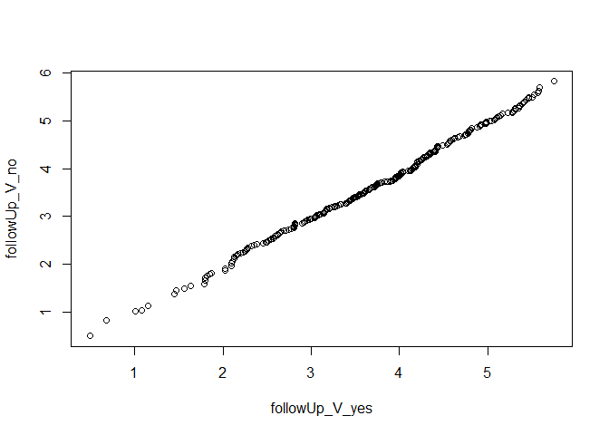

Data used for this project
================
Benny Salo
2018-07-05

``` r
library(dplyr)
```

Load raw data. At this point we are not authorized to make raw data publicly available. `FinPrisonMales.rds` includes only males.

Update data file in "/not\_public"

``` r
devtools::wd()
source("not_public/get_copy_of_FinPrisonData.R")
```

``` r
rm(list = ls())
devtools::wd()
FinPrisonMales <- 
  readRDS("not_public/FinPrisonData.rds") %>% 
  filter(gender == "male")

stopifnot(sum(FinPrisonMales$gender == "male") == nrow(FinPrisonMales))
```

We define a violent crime as crimes that belong to the homicide or assault categories. Other offence categories include offences that are violent and offences that are not violent. In many cases the violent forms are also coded as assault.

We create variables for new violent crime

``` r
analyzed_data <- 
  FinPrisonMales %>% 
  mutate(newO_violent = as.factor(ifelse(newO_homicide == 1 | newO_assault == 1, 
                                         "new_violent_crime", 
                                         "no_crime_or_not_violent")),
         newO_violent = relevel(newO_violent, ref ="no_crime_or_not_violent"))


table(analyzed_data$newO_violent)
```

    ## 
    ## no_crime_or_not_violent       new_violent_crime 
    ##                    1218                     278

``` r
table(analyzed_data$newO_violent)/nrow(analyzed_data)
```

    ## 
    ## no_crime_or_not_violent       new_violent_crime 
    ##               0.8141711               0.1858289

Of the 748 new convictions 278 are categorized as prison terms for violent crimes.

For descriptive statistics we also want a variable that represents category of reoffending as a single variable with levels "no reoffence", "non-violent reoffence", and "violent reoffence".

``` r
# Get indices
no_reoff_i      <- 
  which(analyzed_data$reoffenceThisTerm == "not_in_prison")

non_vio_reoff_i <- 
  which(analyzed_data$reoffenceThisTerm == "new_prison_sentence" &
          analyzed_data$newO_violent == "no_crime_or_not_violent")

vio_reoff_i     <-
  which(analyzed_data$newO_violent == "new_violent_crime")

# Assert that all rows are accounted for
assertthat::assert_that(
  identical(sort(c(no_reoff_i, non_vio_reoff_i, vio_reoff_i)),
            1:nrow(analyzed_data))
)
```

    ## [1] TRUE

``` r
analyzed_data$reoff_category[no_reoff_i]      <- "no_reoffence"
analyzed_data$reoff_category[non_vio_reoff_i] <- "reoffence_nonviolent"
analyzed_data$reoff_category[vio_reoff_i]     <- "reoffence_violent"

analyzed_data$reoff_category <- factor(analyzed_data$reoff_category)
```

Check follow-up time
====================

Compare distributions in follow-up time between those who committed a new crime and those who did not.

``` r
followUp_G_yes <- analyzed_data[
  analyzed_data$reoffenceThisTerm == "new_prison_sentence",
  "followUpYears"]

followUp_G_no <- analyzed_data[
  analyzed_data$reoffenceThisTerm == "not_in_prison",
  "followUpYears"]

followUp_V_yes <- analyzed_data[
  analyzed_data$newO_violent == "new_violent_crime",
  "followUpYears"]

followUp_V_no <- analyzed_data[
  analyzed_data$newO_violent == "no_crime_or_not_violent",
  "followUpYears"]
  
  
qqplot(followUp_G_yes, followUp_G_no)
```


``` r
qqplot(followUp_V_yes, followUp_V_no)
```



The similarity of distributions is close to perfect for general recidivism and very good for violent recidivism.

Check means and standard deviations

``` r
analyzed_data %>% 
  group_by(reoffenceThisTerm) %>% 
  summarise(M = mean(followUpYears),
            SD = sd(followUpYears))
```

    ## # A tibble: 2 x 3
    ##   reoffenceThisTerm       M    SD
    ##   <fct>               <dbl> <dbl>
    ## 1 not_in_prison        3.66  1.04
    ## 2 new_prison_sentence  3.65  1.05

``` r
analyzed_data %>% 
  group_by(newO_violent) %>% 
  summarise(M = mean(followUpYears),
            SD = sd(followUpYears))
```

    ## # A tibble: 2 x 3
    ##   newO_violent                M    SD
    ##   <fct>                   <dbl> <dbl>
    ## 1 no_crime_or_not_violent  3.65  1.04
    ## 2 new_violent_crime        3.70  1.05

Time to offence
===============

``` r
median(analyzed_data$daysToNewO, na.rm = TRUE) 
```

    ## [1] 101.8333

``` r
max(analyzed_data$daysToNewO, na.rm = TRUE) 
```

    ## [1] 1321

``` r
sum(analyzed_data$daysToNewO <= 365, na.rm = TRUE) /748
```

    ## [1] 0.8395722

``` r
# Proportion under 1 year
median(analyzed_data$followUpYears)
```

    ## [1] 3.687886

``` r
min(analyzed_data$followUpYears)
```

    ## [1] 0.4928142

``` r
max(analyzed_data$followUpYears)
```

    ## [1] 5.828885

Split data into a training set and a test set
=============================================

``` r
set.seed(3010)
four_folds   <- caret::createFolds(y = analyzed_data$reoffenceThisTerm, k = 4)

training_set <- analyzed_data[!(1:nrow(analyzed_data) %in% four_folds[[4]]), ]
test_set     <- analyzed_data[ (1:nrow(analyzed_data) %in% four_folds[[4]]), ]

nrow(training_set)
```

    ## [1] 1122

``` r
nrow(test_set)
```

    ## [1] 374

Save data for later use.
========================

Will not be made public.

``` r
devtools::wd()
saveRDS(analyzed_data, "not_public/analyzed_data.rds")
saveRDS(training_set, "not_public/training_set.rds")
saveRDS(test_set,     "not_public/test_set.rds")
```
