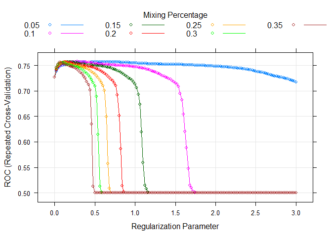
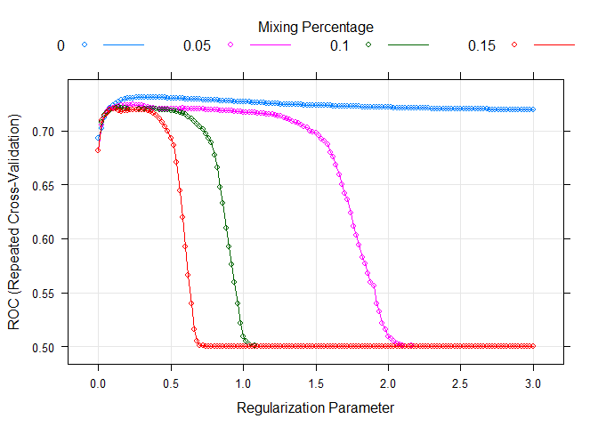
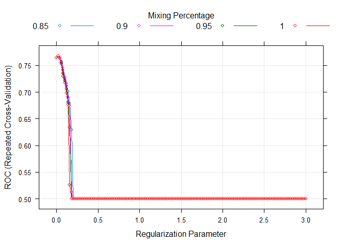
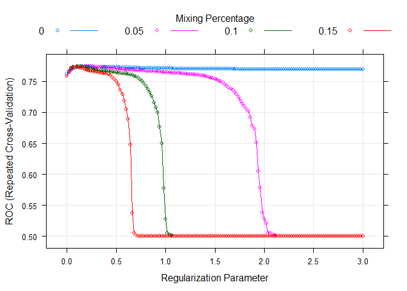
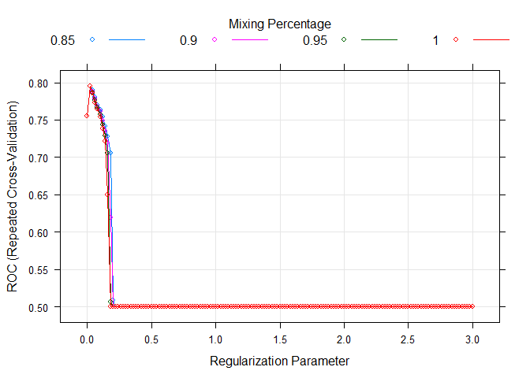
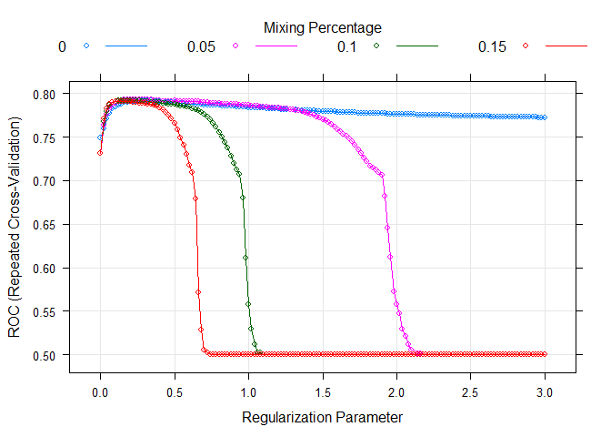
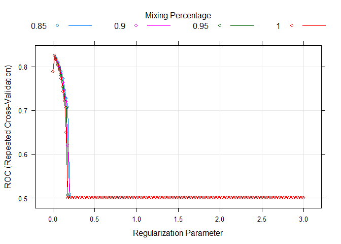
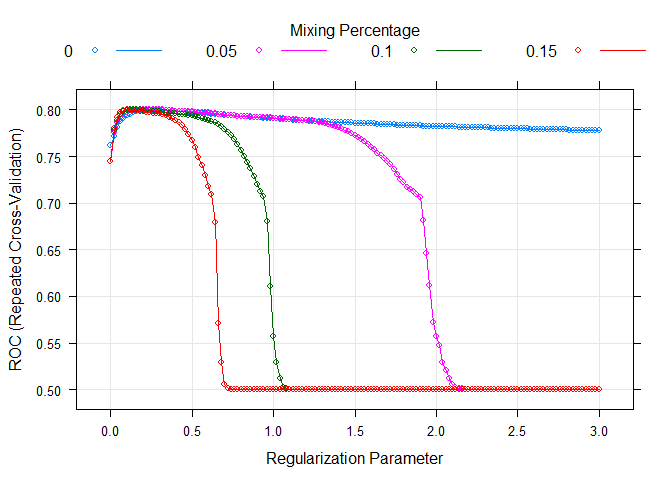

Checking **second** round of glmnet models
================
Benny Salo
2018-07-11

Here we diagnose the results from trained elastic net models. The general pattern is that prediction of violent recidivism is benefited by ridge regression type penalties (alpha = 0) while prediction of general recidivism benefits from more lasso type penalties (alpha = 1).

We update our search by including the best value in this run and values not yet tested that are between the best tested value and adjacent values. In all except the first model this is a search in only one direction since the best tested values are most often either 0 or 1.

Setup
-----

``` r
rm(list = ls())
devtools::load_all(".")
library(dplyr)
```

``` r
devtools::wd()
trained_mods_glmnet_2 <- readRDS("not_public/trained_mods_glmnet_2.rds")
```

Initiate a list to store updated alpha values

``` r
glmnet_grid$alpha3 <- vector("list", length = nrow(glmnet_grid))
```

### Functions

Function for finding best performance per alpha value

``` r
find_best_per_alpha <- function(model_nr) {
  trained_mods_glmnet_2[[model_nr]]$results %>%
    group_by(alpha) %>%
    filter(ROC == max(ROC)) %>%
    select(alpha, lambda, ROC, ROCSD) %>% 
    mutate(d = calc_d_from_AUC(ROC))
}
```

Function for printing several summaries

``` r
diagnose_trained_models <- function(model_nr) {
  print(paste0("Outcome: ", glmnet_grid$outcome[model_nr], 
              ". Predictors: ", glmnet_grid$predictors[model_nr], "."))
  print("Best tuning values:")
  print(trained_mods_glmnet_2[[model_nr]]$bestTune)
  print("Per alpha value:")
  per_alpha_table <- find_best_per_alpha(model_nr)
  print(per_alpha_table)
  print(paste("Max - min d:", round(max(per_alpha_table$d) - 
                                      min(per_alpha_table$d), 3)))
  plot(trained_mods_glmnet_2[[model_nr]])
}
```

Analyses
--------

### Model 1

``` r
diagnose_trained_models(1)
```

    ## [1] "Outcome: General recidivism. Predictors: Rita."
    ## [1] "Best tuning values:"
    ##     alpha lambda
    ## 166   0.1   0.28
    ## [1] "Per alpha value:"
    ## # A tibble: 7 x 5
    ## # Groups:   alpha [7]
    ##   alpha lambda   ROC  ROCSD     d
    ##   <dbl>  <dbl> <dbl>  <dbl> <dbl>
    ## 1  0.05   0.74 0.757 0.0467 0.984
    ## 2  0.1    0.28 0.757 0.0470 0.987
    ## 3  0.15   0.18 0.757 0.0467 0.986
    ## 4  0.2    0.14 0.757 0.0465 0.984
    ## 5  0.25   0.12 0.756 0.0463 0.982
    ## 6  0.3    0.08 0.756 0.0464 0.982
    ## 7  0.35   0.08 0.756 0.0463 0.981
    ## [1] "Max - min d: 0.006"



``` r
glmnet_grid$alpha3[[1]] <- c(seq(from = 0.06, to = 0.14, by = 0.02))
```

### Model 2

``` r
diagnose_trained_models(2)
```

    ## [1] "Outcome: Violent recidivism. Predictors: Rita."
    ## [1] "Best tuning values:"
    ##    alpha lambda
    ## 18     0   0.34
    ## [1] "Per alpha value:"
    ## # A tibble: 4 x 5
    ## # Groups:   alpha [4]
    ##   alpha lambda   ROC  ROCSD     d
    ##   <dbl>  <dbl> <dbl>  <dbl> <dbl>
    ## 1  0      0.34 0.731 0.0630 0.872
    ## 2  0.05   0.24 0.724 0.0647 0.842
    ## 3  0.1    0.14 0.722 0.0647 0.832
    ## 4  0.15   0.1  0.720 0.0645 0.824
    ## [1] "Max - min d: 0.047"



``` r
glmnet_grid$alpha3[[2]] <- c(seq(from = 0, to = 0.4, by = 0.01))
```

### Model 3

``` r
diagnose_trained_models(3)
```

    ## [1] "Outcome: General recidivism. Predictors: Static."
    ## [1] "Best tuning values:"
    ##   alpha lambda
    ## 2  0.85   0.02
    ## [1] "Per alpha value:"
    ## # A tibble: 4 x 5
    ## # Groups:   alpha [4]
    ##   alpha lambda   ROC  ROCSD     d
    ##   <dbl>  <dbl> <dbl>  <dbl> <dbl>
    ## 1  0.85   0.02 0.768 0.0453  1.04
    ## 2  0.9    0.02 0.768 0.0453  1.04
    ## 3  0.95   0.02 0.768 0.0452  1.04
    ## 4  1      0.02 0.768 0.0452  1.04
    ## [1] "Max - min d: 0"



``` r
glmnet_grid$alpha3[[3]] <- c(seq(from = 0.81, to = 0.89, by = 0.02))
```

### Model 4

``` r
diagnose_trained_models(4)
```

    ## [1] "Outcome: Violent recidivism. Predictors: Static."
    ## [1] "Best tuning values:"
    ##     alpha lambda
    ## 159  0.05   0.14
    ## [1] "Per alpha value:"
    ## # A tibble: 4 x 5
    ## # Groups:   alpha [4]
    ##   alpha lambda   ROC  ROCSD     d
    ##   <dbl>  <dbl> <dbl>  <dbl> <dbl>
    ## 1  0      0.26 0.774 0.0505  1.06
    ## 2  0.05   0.14 0.775 0.0499  1.07
    ## 3  0.1    0.12 0.775 0.0495  1.07
    ## 4  0.15   0.08 0.774 0.0490  1.06
    ## [1] "Max - min d: 0.004"



``` r
glmnet_grid$alpha3[[4]] <- seq(from = 0.01, to = 0.09, by = 0.02)
```

### Model 5

``` r
diagnose_trained_models(5)
```

    ## [1] "Outcome: General recidivism. Predictors: All at start of sentence."
    ## [1] "Best tuning values:"
    ##     alpha lambda
    ## 304  0.95   0.02
    ## [1] "Per alpha value:"
    ## # A tibble: 4 x 5
    ## # Groups:   alpha [4]
    ##   alpha lambda   ROC  ROCSD     d
    ##   <dbl>  <dbl> <dbl>  <dbl> <dbl>
    ## 1  0.85   0.02 0.795 0.0449  1.17
    ## 2  0.9    0.02 0.795 0.0449  1.17
    ## 3  0.95   0.02 0.796 0.0449  1.17
    ## 4  1      0.02 0.796 0.0447  1.17
    ## [1] "Max - min d: 0.003"



``` r
glmnet_grid$alpha3[[5]] <- seq(from = 0.91, to = 0.99, by = 0.02)
```

### Model 6

``` r
diagnose_trained_models(6)
```

    ## [1] "Outcome: Violent recidivism. Predictors: All at start of sentence."
    ## [1] "Best tuning values:"
    ##     alpha lambda
    ## 164  0.05   0.24
    ## [1] "Per alpha value:"
    ## # A tibble: 4 x 5
    ## # Groups:   alpha [4]
    ##   alpha lambda   ROC  ROCSD     d
    ##   <dbl>  <dbl> <dbl>  <dbl> <dbl>
    ## 1  0      0.28 0.792 0.0528  1.15
    ## 2  0.05   0.24 0.793 0.0526  1.16
    ## 3  0.1    0.16 0.792 0.0516  1.15
    ## 4  0.15   0.14 0.791 0.0505  1.15
    ## [1] "Max - min d: 0.011"



``` r
glmnet_grid$alpha3[[6]] <- seq(from = 0.01, to = 0.09, by = 0.02)
```

### Model 7

``` r
diagnose_trained_models(7)
```

    ## [1] "Outcome: General recidivism. Predictors: All including term."
    ## [1] "Best tuning values:"
    ##     alpha lambda
    ## 304  0.95   0.02
    ## [1] "Per alpha value:"
    ## # A tibble: 4 x 5
    ## # Groups:   alpha [4]
    ##   alpha lambda   ROC  ROCSD     d
    ##   <dbl>  <dbl> <dbl>  <dbl> <dbl>
    ## 1  0.85   0.02 0.825 0.0393  1.32
    ## 2  0.9    0.02 0.825 0.0392  1.32
    ## 3  0.95   0.02 0.825 0.0389  1.32
    ## 4  1      0.02 0.825 0.0389  1.32
    ## [1] "Max - min d: 0.001"



``` r
glmnet_grid$alpha3[[7]] <- seq(from = 0.91, to = 0.99, by = 0.02)
```

### Model 8

``` r
diagnose_trained_models(8)
```

    ## [1] "Outcome: Violent recidivism. Predictors: All including term."
    ## [1] "Best tuning values:"
    ##     alpha lambda
    ## 163  0.05   0.22
    ## [1] "Per alpha value:"
    ## # A tibble: 4 x 5
    ## # Groups:   alpha [4]
    ##   alpha lambda   ROC  ROCSD     d
    ##   <dbl>  <dbl> <dbl>  <dbl> <dbl>
    ## 1  0      0.24 0.800 0.0501  1.19
    ## 2  0.05   0.22 0.801 0.0498  1.19
    ## 3  0.1    0.14 0.801 0.0486  1.19
    ## 4  0.15   0.1  0.800 0.0481  1.19
    ## [1] "Max - min d: 0.005"



``` r
glmnet_grid$alpha3[[8]] <- seq(from = 0.01, to = 0.09, by = 0.02)
```

Overwrite `glmnet_grid`in `/data` with this version that contains the `alpha3` column

``` r
devtools::use_data(glmnet_grid, overwrite = TRUE)
```

### Print sessionInfo

``` r
sessionInfo()
```

    ## R version 3.5.1 (2018-07-02)
    ## Platform: x86_64-w64-mingw32/x64 (64-bit)
    ## Running under: Windows 10 x64 (build 17134)
    ## 
    ## Matrix products: default
    ## 
    ## locale:
    ## [1] LC_COLLATE=Swedish_Finland.1252  LC_CTYPE=Swedish_Finland.1252   
    ## [3] LC_MONETARY=Swedish_Finland.1252 LC_NUMERIC=C                    
    ## [5] LC_TIME=Swedish_Finland.1252    
    ## 
    ## attached base packages:
    ## [1] stats     graphics  grDevices utils     datasets  methods   base     
    ## 
    ## other attached packages:
    ## [1] bindrcpp_0.2.2          dplyr_0.7.6             recidivismsl_0.0.0.9000
    ## 
    ## loaded via a namespace (and not attached):
    ##  [1] magic_1.5-8        ddalpha_1.3.4      tidyr_0.8.1       
    ##  [4] sfsmisc_1.1-2      splines_3.5.1      foreach_1.4.4     
    ##  [7] prodlim_2018.04.18 assertthat_0.2.0   stats4_3.5.1      
    ## [10] DRR_0.0.3          yaml_2.1.19        robustbase_0.93-1 
    ## [13] ipred_0.9-6        pillar_1.2.3       backports_1.1.2   
    ## [16] lattice_0.20-35    glue_1.2.0         pROC_1.12.1       
    ## [19] digest_0.6.15      colorspace_1.3-2   recipes_0.1.3     
    ## [22] htmltools_0.3.6    Matrix_1.2-14      plyr_1.8.4        
    ## [25] psych_1.8.4        timeDate_3043.102  pkgconfig_2.0.1   
    ## [28] devtools_1.13.6    CVST_0.2-2         broom_0.4.5       
    ## [31] caret_6.0-80       purrr_0.2.5        scales_0.5.0      
    ## [34] gower_0.1.2        lava_1.6.2         tibble_1.4.2      
    ## [37] ggplot2_3.0.0      withr_2.1.2        nnet_7.3-12       
    ## [40] lazyeval_0.2.1     cli_1.0.0          mnormt_1.5-5      
    ## [43] crayon_1.3.4       survival_2.42-3    magrittr_1.5      
    ## [46] memoise_1.1.0      evaluate_0.10.1    nlme_3.1-137      
    ## [49] MASS_7.3-50        xml2_1.2.0         dimRed_0.1.0      
    ## [52] foreign_0.8-70     class_7.3-14       ggthemes_3.5.0    
    ## [55] tools_3.5.1        stringr_1.3.1      kernlab_0.9-26    
    ## [58] glmnet_2.0-16      munsell_0.5.0      pls_2.6-0         
    ## [61] compiler_3.5.1     RcppRoll_0.3.0     rlang_0.2.1       
    ## [64] grid_3.5.1         iterators_1.0.9    rmarkdown_1.10    
    ## [67] testthat_2.0.0     geometry_0.3-6     gtable_0.2.0      
    ## [70] ModelMetrics_1.1.0 codetools_0.2-15   abind_1.4-5       
    ## [73] roxygen2_6.0.1     reshape2_1.4.3     R6_2.2.2          
    ## [76] lubridate_1.7.4    knitr_1.20         utf8_1.1.4        
    ## [79] bindr_0.1.1        commonmark_1.5     rprojroot_1.3-2   
    ## [82] stringi_1.1.7      parallel_3.5.1     Rcpp_0.12.17      
    ## [85] rpart_4.1-13       DEoptimR_1.0-8     tidyselect_0.2.4
