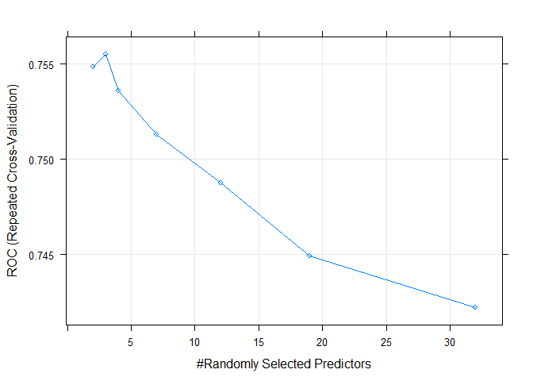
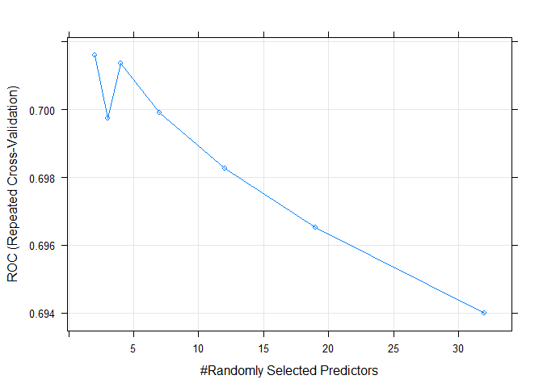
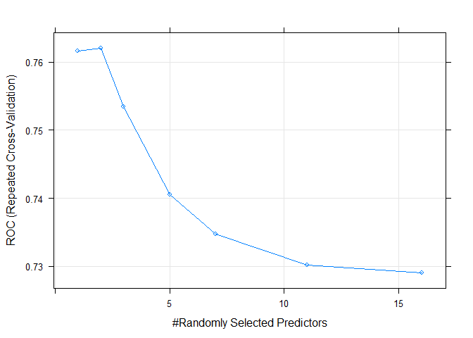
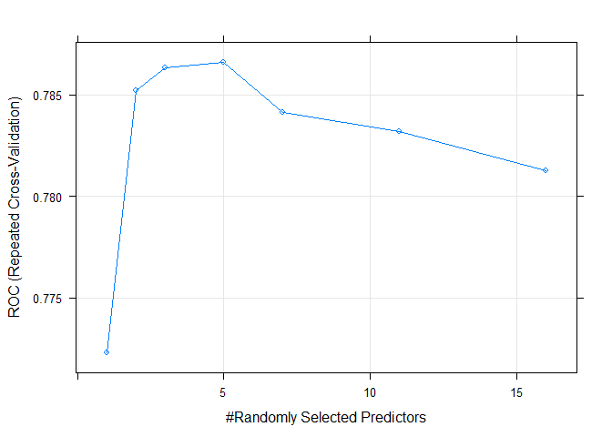
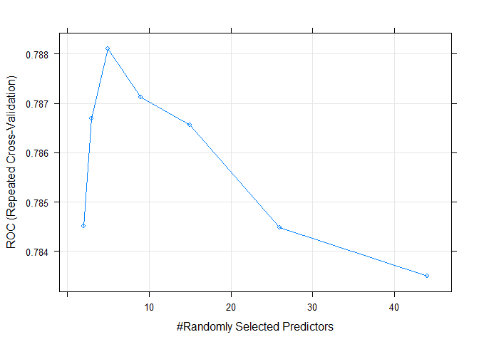
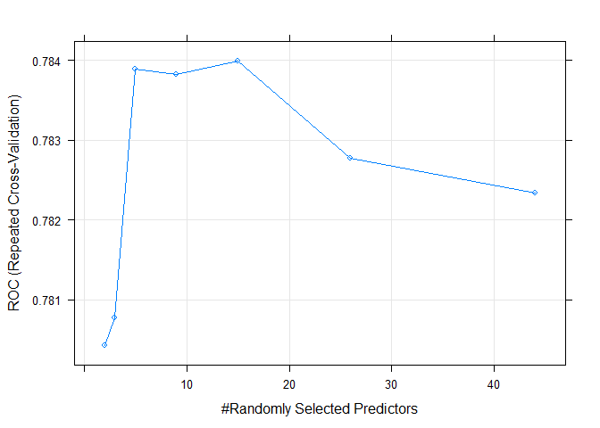
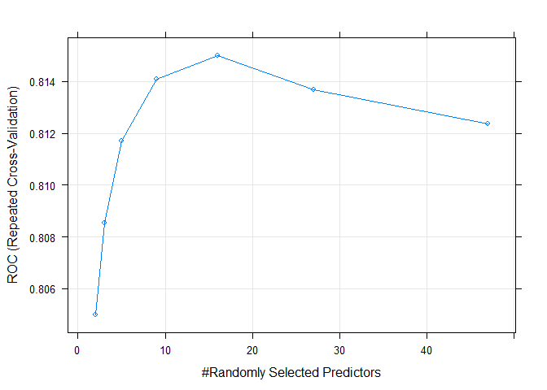
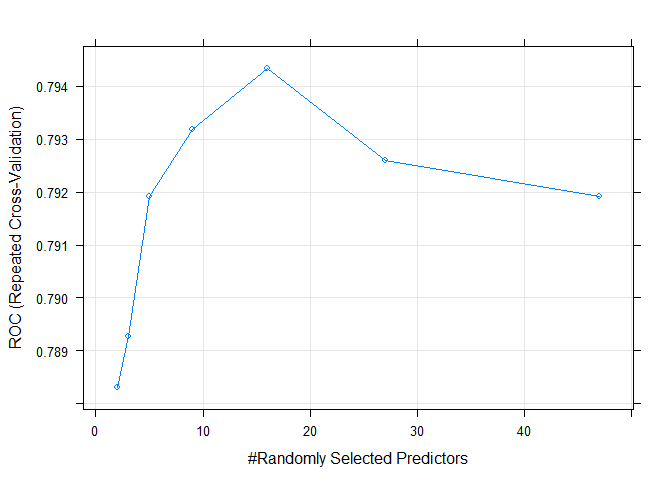

Checking first round of random forest models and update mtrys
================
Benny Salo
2018-07-11

Here we check the results from the first round of random forest models and see if there are other values of mtry we would like to test.

``` r
library(dplyr)
devtools::load_all(".")

devtools::wd()
trained_mods_rf <- readRDS("not_public/trained_mods_rf.rds")
```

``` r
rf_grid$mtry_seq2 <- vector("list", nrow(rf_grid))
```

### Functions

Function for finding best performance per alpha value

``` r
find_best_per_mtry <- function(model_nr) {
  trained_mods_rf[[model_nr]]$results %>%
    select(mtry, ROC, ROCSD) %>% 
    mutate(d = calc_d_from_AUC(ROC))
}
```

Function for printing several summaries

``` r
diagnose_trained_rf_models <- function(model_nr) {
  print(paste0("Outcome: ", rf_grid$outcome[model_nr], 
              ". Predictors: ", rf_grid$predictors[model_nr], "."))
  print("Tested mtrys:")
  print(rf_grid$mtry_seq[[model_nr]])
  print(paste("Best:", trained_mods_rf[[model_nr]]$bestTune))
  print("Per alpha value:")
  per_mtry_table <- find_best_per_mtry(model_nr)
  print(per_mtry_table)
  print(paste("Max - min d:", round(max(per_mtry_table$d) - 
                                      min(per_mtry_table$d), 3)))
  plot(trained_mods_rf[[model_nr]])
}
```

### Model 1

``` r
diagnose_trained_rf_models(1)
```

    ## [1] "Outcome: General recidivism. Predictors: Rita."
    ## [1] "Tested mtrys:"
    ## [1]  2  3  4  7 12 19 32
    ## [1] "Best: 3"
    ## [1] "Per alpha value:"
    ##   mtry       ROC      ROCSD         d
    ## 1    2 0.7548692 0.04638363 0.9756557
    ## 2    3 0.7555014 0.04613627 0.9785012
    ## 3    4 0.7536199 0.04760672 0.9700448
    ## 4    7 0.7513271 0.04885284 0.9597869
    ## 5   12 0.7487770 0.04890989 0.9484367
    ## 6   19 0.7449217 0.04943200 0.9313922
    ## 7   32 0.7422343 0.05106245 0.9195908
    ## [1] "Max - min d: 0.059"



``` r
rf_grid$mtry_seq2[[1]] <- 3
```

### Model 2

``` r
diagnose_trained_rf_models(2)
```

    ## [1] "Outcome: Violent recidivism. Predictors: Rita."
    ## [1] "Tested mtrys:"
    ## [1]  2  3  4  7 12 19 32
    ## [1] "Best: 2"
    ## [1] "Per alpha value:"
    ##   mtry       ROC      ROCSD         d
    ## 1    2 0.7015935 0.06440164 0.7481034
    ## 2    3 0.6997470 0.06569135 0.7405853
    ## 3    4 0.7013680 0.06520878 0.7471843
    ## 4    7 0.6999056 0.06395282 0.7412303
    ## 5   12 0.6982628 0.06315284 0.7345575
    ## 6   19 0.6965203 0.06285359 0.7274977
    ## 7   32 0.6940052 0.06363017 0.7173391
    ## [1] "Max - min d: 0.031"



``` r
rf_grid$mtry_seq2[[2]] <- c(1, 2)
```

### Model 3

``` r
diagnose_trained_rf_models(3)
```

    ## [1] "Outcome: General recidivism. Predictors: Static."
    ## [1] "Tested mtrys:"
    ## [1]  1  2  3  5  7 11 16
    ## [1] "Best: 2"
    ## [1] "Per alpha value:"
    ##   mtry       ROC      ROCSD         d
    ## 1    1 0.7615975 0.04856068 1.0061432
    ## 2    2 0.7619999 0.04801377 1.0079813
    ## 3    3 0.7534347 0.04800557 0.9692146
    ## 4    5 0.7405322 0.04613292 0.9121492
    ## 5    7 0.7347701 0.04596845 0.8871421
    ## 6   11 0.7301914 0.04600744 0.8674674
    ## 7   16 0.7291052 0.04520026 0.8628246
    ## [1] "Max - min d: 0.145"



``` r
rf_grid$mtry_seq2[[3]] <- 2
```

### Model 4

``` r
diagnose_trained_rf_models(4)
```

    ## [1] "Outcome: Violent recidivism. Predictors: Static."
    ## [1] "Tested mtrys:"
    ## [1]  1  2  3  5  7 11 16
    ## [1] "Best: 5"
    ## [1] "Per alpha value:"
    ##   mtry       ROC      ROCSD        d
    ## 1    1 0.7723214 0.05109548 1.055730
    ## 2    2 0.7852144 0.04581630 1.117124
    ## 3    3 0.7863246 0.04469042 1.122508
    ## 4    5 0.7865819 0.04323899 1.123758
    ## 5    7 0.7841240 0.04330416 1.111851
    ## 6   11 0.7832046 0.04358739 1.107417
    ## 7   16 0.7812618 0.04259815 1.098083
    ## [1] "Max - min d: 0.068"



``` r
rf_grid$mtry_seq2[[4]] <- c(4, 5, 6)
```

### Model 5

``` r
diagnose_trained_rf_models(5)
```

    ## [1] "Outcome: General recidivism. Predictors: All at start of sentence."
    ## [1] "Tested mtrys:"
    ## [1]  2  3  5  9 15 26 44
    ## [1] "Best: 5"
    ## [1] "Per alpha value:"
    ##   mtry       ROC      ROCSD        d
    ## 1    2 0.7845096 0.04511218 1.113714
    ## 2    3 0.7866911 0.04561650 1.124289
    ## 3    5 0.7881003 0.04652020 1.131154
    ## 4    9 0.7871289 0.04664703 1.126419
    ## 5   15 0.7865606 0.04652531 1.123655
    ## 6   26 0.7844827 0.04775267 1.113583
    ## 7   44 0.7835058 0.04774696 1.108868
    ## [1] "Max - min d: 0.022"



``` r
rf_grid$mtry_seq2[[5]] <- c(4, 5, 6, 7, 8)
```

### Model 6

``` r
diagnose_trained_rf_models(6)
```

    ## [1] "Outcome: Violent recidivism. Predictors: All at start of sentence."
    ## [1] "Tested mtrys:"
    ## [1]  2  3  5  9 15 26 44
    ## [1] "Best: 15"
    ## [1] "Per alpha value:"
    ##   mtry       ROC      ROCSD        d
    ## 1    2 0.7804306 0.05712560 1.094104
    ## 2    3 0.7807706 0.05719100 1.095730
    ## 3    5 0.7838931 0.05384347 1.110736
    ## 4    9 0.7838248 0.05220502 1.110407
    ## 5   15 0.7839845 0.05149612 1.111177
    ## 6   26 0.7827713 0.05325599 1.105331
    ## 7   44 0.7823399 0.05213757 1.103256
    ## [1] "Max - min d: 0.017"



``` r
rf_grid$mtry_seq2[[6]] <- c(11, 13, 15, 18, 22)
```

### Model 7

``` r
diagnose_trained_rf_models(7)
```

    ## [1] "Outcome: General recidivism. Predictors: All including term."
    ## [1] "Tested mtrys:"
    ## [1]  2  3  5  9 16 27 47
    ## [1] "Best: 16"
    ## [1] "Per alpha value:"
    ##   mtry       ROC      ROCSD        d
    ## 1    2 0.8050051 0.04379654 1.215709
    ## 2    3 0.8085331 0.04151257 1.233906
    ## 3    5 0.8117230 0.04280257 1.250537
    ## 4    9 0.8140869 0.04107713 1.262974
    ## 5   16 0.8149905 0.04168745 1.267754
    ## 6   27 0.8136832 0.04143175 1.260844
    ## 7   47 0.8123549 0.04144026 1.253852
    ## [1] "Max - min d: 0.052"



``` r
rf_grid$mtry_seq2[[7]] <- c(12, 14, 16, 19, 22)
```

### Model 8

``` r
diagnose_trained_rf_models(8)
```

    ## [1] "Outcome: Violent recidivism. Predictors: All including term."
    ## [1] "Tested mtrys:"
    ## [1]  2  3  5  9 16 27 47
    ## [1] "Best: 16"
    ## [1] "Per alpha value:"
    ##   mtry       ROC      ROCSD        d
    ## 1    2 0.7883175 0.05443593 1.132215
    ## 2    3 0.7892713 0.05493514 1.136880
    ## 3    5 0.7919126 0.05396946 1.149863
    ## 4    9 0.7931760 0.05407102 1.156106
    ## 5   16 0.7943254 0.05420898 1.161807
    ## 6   27 0.7925881 0.05257774 1.153198
    ## 7   47 0.7919177 0.05380133 1.149887
    ## [1] "Max - min d: 0.03"



``` r
rf_grid$mtry_seq2[[8]] <- c(12, 14, 16, 19, 22)
```

Overwrite `rf_grid`in `/data` with this version that contains the `mtry_seq2` column

``` r
devtools::use_data(rf_grid, overwrite = TRUE)
```

Print sessionInfo

``` r
sessionInfo()
```

    ## R version 3.5.1 (2018-07-02)
    ## Platform: x86_64-w64-mingw32/x64 (64-bit)
    ## Running under: Windows 10 x64 (build 17134)
    ## 
    ## Matrix products: default
    ## 
    ## locale:
    ## [1] LC_COLLATE=Swedish_Finland.1252  LC_CTYPE=Swedish_Finland.1252   
    ## [3] LC_MONETARY=Swedish_Finland.1252 LC_NUMERIC=C                    
    ## [5] LC_TIME=Swedish_Finland.1252    
    ## 
    ## attached base packages:
    ## [1] stats     graphics  grDevices utils     datasets  methods   base     
    ## 
    ## other attached packages:
    ## [1] bindrcpp_0.2.2          recidivismsl_0.0.0.9000 dplyr_0.7.6            
    ## 
    ## loaded via a namespace (and not attached):
    ##  [1] magic_1.5-8        ddalpha_1.3.4      tidyr_0.8.1       
    ##  [4] sfsmisc_1.1-2      splines_3.5.1      foreach_1.4.4     
    ##  [7] prodlim_2018.04.18 assertthat_0.2.0   stats4_3.5.1      
    ## [10] DRR_0.0.3          yaml_2.1.19        robustbase_0.93-1 
    ## [13] ipred_0.9-6        pillar_1.2.3       backports_1.1.2   
    ## [16] lattice_0.20-35    glue_1.2.0         pROC_1.12.1       
    ## [19] digest_0.6.15      colorspace_1.3-2   recipes_0.1.3     
    ## [22] htmltools_0.3.6    Matrix_1.2-14      plyr_1.8.4        
    ## [25] psych_1.8.4        timeDate_3043.102  pkgconfig_2.0.1   
    ## [28] devtools_1.13.6    CVST_0.2-2         broom_0.4.5       
    ## [31] caret_6.0-80       purrr_0.2.5        scales_0.5.0      
    ## [34] gower_0.1.2        lava_1.6.2         tibble_1.4.2      
    ## [37] ggplot2_3.0.0      withr_2.1.2        nnet_7.3-12       
    ## [40] lazyeval_0.2.1     mnormt_1.5-5       survival_2.42-3   
    ## [43] magrittr_1.5       memoise_1.1.0      evaluate_0.10.1   
    ## [46] nlme_3.1-137       MASS_7.3-50        xml2_1.2.0        
    ## [49] dimRed_0.1.0       foreign_0.8-70     class_7.3-14      
    ## [52] ggthemes_3.5.0     tools_3.5.1        stringr_1.3.1     
    ## [55] kernlab_0.9-26     munsell_0.5.0      pls_2.6-0         
    ## [58] compiler_3.5.1     RcppRoll_0.3.0     rlang_0.2.1       
    ## [61] grid_3.5.1         iterators_1.0.9    rmarkdown_1.10    
    ## [64] testthat_2.0.0     geometry_0.3-6     gtable_0.2.0      
    ## [67] ModelMetrics_1.1.0 codetools_0.2-15   abind_1.4-5       
    ## [70] roxygen2_6.0.1     reshape2_1.4.3     R6_2.2.2          
    ## [73] lubridate_1.7.4    knitr_1.20         bindr_0.1.1       
    ## [76] commonmark_1.5     rprojroot_1.3-2    stringi_1.1.7     
    ## [79] parallel_3.5.1     Rcpp_0.12.17       rpart_4.1-13      
    ## [82] DEoptimR_1.0-8     tidyselect_0.2.4
