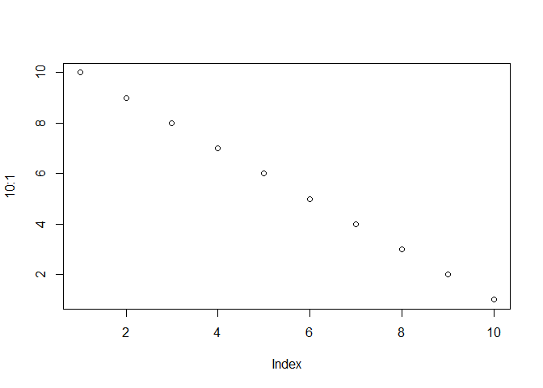

Descriptive statistics
================
Benny Salo
2019-04-02

This package includes the data objects with descriptive statistics: `descriptive_stats_cat` (for categorical variables) and `descriptive_stats_num` (for numerical variables. These objects are data frames that can be used for further analyzes such as mean differences and chi-square tables.

For readers that only want to see the descriptive statistics we print out the tables below.

We can use the information in `variable_table` to replace the variable names with longer variable labels

``` r
library(recidivismsl)

# Create a replacement vector
variable_labels <- variable_table$Label
names(variable_labels) <- variable_table$Variable
```

Categorical variables
---------------------

*Frequencies and percentages by reoffence group.Key: NoRe = No reoffence, NViolRe = Non-violent reoffence, VioRe = Violent Reoffence, n = frequencies, % = percentages.*

``` r
printed_cat  <- descriptive_stats_cat
names(printed_cat) <- c("Variable", "Level", 
                         "NoRe n", "NViolRe n", "VioRe n",
                         "NoRe %", "NViolRe %", "VioRe %")


printed_cat$Variable <- variable_labels[printed_cat$Variable]


knitr::kable(printed_cat, digits = 1)
```

| Variable                                       | Level                            |  NoRe n|  NViolRe n|  VioRe n|  NoRe %|  NViolRe %|  VioRe %|
|:-----------------------------------------------|:---------------------------------|-------:|----------:|--------:|-------:|----------:|--------:|
| NA                                             | NA                               |     748|        470|      278|    50.0|       31.4|     18.6|
| Missing info on age at first term              | 0                                |     537|        293|      240|    35.9|       19.6|     16.0|
| Missing info on age at first term              | 1                                |     211|        177|       38|    14.1|       11.8|      2.5|
| Conditional release granted                    | 0                                |     748|        410|      222|    50.0|       27.4|     14.8|
| Conditional release granted                    | 1                                |       0|         60|       56|     0.0|        4.0|      3.7|
| Conditional release                            | Cancelled conditional release    |      40|         20|       15|     2.7|        1.3|      1.0|
| Conditional release                            | No conditional release           |     511|        407|      241|    34.2|       27.2|     16.1|
| Conditional release                            | Successful conditional relase    |     197|         43|       22|    13.2|        2.9|      1.5|
| Conditional release successful                 | no\_cr\_or\_revoked              |     551|        427|      256|    36.8|       28.5|     17.1|
| Conditional release successful                 | successful\_cr                   |     197|         43|       22|    13.2|        2.9|      1.5|
| Crime during sentence                          | No records of crime              |     747|        415|      241|    49.9|       27.7|     16.1|
| Crime during sentence                          | Record of crime                  |       1|         55|       37|     0.1|        3.7|      2.5|
| Alcohol-related offenses                       | 0                                |     274|        148|       42|    18.3|        9.9|      2.8|
| Alcohol-related offenses                       | 1                                |     189|        122|       75|    12.6|        8.2|      5.0|
| Alcohol-related offenses                       | 2                                |     285|        200|      161|    19.1|       13.4|     10.8|
| Effects of alcohol on health                   | 0                                |     639|        381|      235|    42.7|       25.5|     15.7|
| Effects of alcohol on health                   | 1                                |      83|         66|       30|     5.5|        4.4|      2.0|
| Effects of alcohol on health                   | 2                                |      26|         23|       13|     1.7|        1.5|      0.9|
| Effects of alcohol on relationships            | 0                                |     407|        217|       97|    27.2|       14.5|      6.5|
| Effects of alcohol on relationships            | 1                                |     248|        180|      119|    16.6|       12.0|      8.0|
| Effects of alcohol on relationships            | 2                                |      93|         73|       62|     6.2|        4.9|      4.1|
| Effects of alcohol on daily living             | 0                                |     423|        208|      102|    28.3|       13.9|      6.8|
| Effects of alcohol on daily living             | 1                                |     224|        148|       96|    15.0|        9.9|      6.4|
| Effects of alcohol on daily living             | 2                                |     101|        114|       80|     6.8|        7.6|      5.3|
| Alcohol use frequency                          | 0                                |     336|        170|       62|    22.5|       11.4|      4.1|
| Alcohol use frequency                          | 1                                |     241|        152|      102|    16.1|       10.2|      6.8|
| Alcohol use frequency                          | 2                                |     171|        148|      114|    11.4|        9.9|      7.6|
| Motivation to tackle alcohol misuse            | 0                                |     600|        343|      177|    40.1|       22.9|     11.8|
| Motivation to tackle alcohol misuse            | 1                                |     110|         91|       70|     7.4|        6.1|      4.7|
| Motivation to tackle alcohol misuse            | 2                                |      38|         36|       31|     2.5|        2.4|      2.1|
| Alcohol-induced violence                       | 0                                |     302|        174|       48|    20.2|       11.6|      3.2|
| Alcohol-induced violence                       | 1                                |     218|        142|       73|    14.6|        9.5|      4.9|
| Alcohol-induced violence                       | 2                                |     228|        154|      157|    15.2|       10.3|     10.5|
| Alcohol with medicine misuse                   | 0                                |     584|        303|      140|    39.0|       20.3|      9.4|
| Alcohol with medicine misuse                   | 1                                |      48|         49|       44|     3.2|        3.3|      2.9|
| Alcohol with medicine misuse                   | 2                                |     116|        118|       94|     7.8|        7.9|      6.3|
| Interpersonal hostility                        | 0                                |     631|        385|      197|    42.2|       25.7|     13.2|
| Interpersonal hostility                        | 1                                |      91|         70|       65|     6.1|        4.7|      4.3|
| Interpersonal hostility                        | 2                                |      26|         15|       16|     1.7|        1.0|      1.1|
| Pro-criminal attitudes                         | 0                                |     414|        184|      115|    27.7|       12.3|      7.7|
| Pro-criminal attitudes                         | 1                                |     273|        215|      132|    18.2|       14.4|      8.8|
| Pro-criminal attitudes                         | 2                                |      61|         71|       31|     4.1|        4.7|      2.1|
| Attitude toward staff and authorities          | 0                                |     658|        383|      207|    44.0|       25.6|     13.8|
| Attitude toward staff and authorities          | 1                                |      81|         77|       60|     5.4|        5.1|      4.0|
| Attitude toward staff and authorities          | 2                                |       9|         10|       11|     0.6|        0.7|      0.7|
| Attitude towards parole supervision            | 0                                |     654|        368|      218|    43.7|       24.6|     14.6|
| Attitude towards parole supervision            | 1                                |      77|         79|       45|     5.1|        5.3|      3.0|
| Attitude towards parole supervision            | 2                                |      17|         23|       15|     1.1|        1.5|      1.0|
| Completed compulsory school                    | 0                                |     712|        417|      265|    47.6|       27.9|     17.7|
| Completed compulsory school                    | 2                                |      36|         53|       13|     2.4|        3.5|      0.9|
| Management of daily living                     | 0                                |     645|        348|      206|    43.1|       23.3|     13.8|
| Management of daily living                     | 1                                |      83|         98|       50|     5.5|        6.6|      3.3|
| Management of daily living                     | 2                                |      20|         24|       22|     1.3|        1.6|      1.5|
| Domestic violence, victim                      | 0                                |     622|        381|      213|    41.6|       25.5|     14.2|
| Domestic violence, victim                      | 1                                |      88|         66|       42|     5.9|        4.4|      2.8|
| Domestic violence, victim                      | 2                                |      38|         23|       23|     2.5|        1.5|      1.5|
| Domestic violence, offender                    | 0                                |     565|        367|      189|    37.8|       24.5|     12.6|
| Domestic violence, offender                    | 1                                |      85|         72|       37|     5.7|        4.8|      2.5|
| Domestic violence, offender                    | 2                                |      98|         31|       52|     6.6|        2.1|      3.5|
| Drug-related offenses                          | 0                                |     625|        307|      154|    41.8|       20.5|     10.3|
| Drug-related offenses                          | 1                                |      41|         37|       46|     2.7|        2.5|      3.1|
| Drug-related offenses                          | 2                                |      82|        126|       78|     5.5|        8.4|      5.2|
| Effects of drugs on health                     | 0                                |     671|        344|      179|    44.9|       23.0|     12.0|
| Effects of drugs on health                     | 1                                |      47|         83|       54|     3.1|        5.5|      3.6|
| Effects of drugs on health                     | 2                                |      30|         43|       45|     2.0|        2.9|      3.0|
| Effects of drugs on relationship               | 0                                |     640|        329|      172|    42.8|       22.0|     11.5|
| Effects of drugs on relationship               | 1                                |      75|         83|       61|     5.0|        5.5|      4.1|
| Effects of drugs on relationship               | 2                                |      33|         58|       45|     2.2|        3.9|      3.0|
| Effects of drugs on daily living               | 0                                |     637|        322|      174|    42.6|       21.5|     11.6|
| Effects of drugs on daily living               | 1                                |      50|         56|       40|     3.3|        3.7|      2.7|
| Effects of drugs on daily living               | 2                                |      61|         92|       64|     4.1|        6.1|      4.3|
| Drug use frequency                             | 0                                |     602|        297|      145|    40.2|       19.9|      9.7|
| Drug use frequency                             | 1                                |      66|         63|       48|     4.4|        4.2|      3.2|
| Drug use frequency                             | 2                                |      80|        110|       85|     5.3|        7.4|      5.7|
| History of drug abuse                          | 0                                |     263|         65|       51|    17.6|        4.3|      3.4|
| History of drug abuse                          | 1                                |      60|         38|       36|     4.0|        2.5|      2.4|
| History of drug abuse                          | 2                                |     425|        367|      191|    28.4|       24.5|     12.8|
| Intravenous drug use                           | 0                                |     629|        307|      149|    42.0|       20.5|     10.0|
| Intravenous drug use                           | 1                                |       7|         11|        8|     0.5|        0.7|      0.5|
| Intravenous drug use                           | 2                                |     112|        152|      121|     7.5|       10.2|      8.1|
| Motivation to tackle drug misuse               | 0                                |     694|        391|      217|    46.4|       26.1|     14.5|
| Motivation to tackle drug misuse               | 1                                |      38|         54|       41|     2.5|        3.6|      2.7|
| Motivation to tackle drug misuse               | 2                                |      16|         25|       20|     1.1|        1.7|      1.3|
| Drug-induced violence                          | 0                                |     700|        414|      198|    46.8|       27.7|     13.2|
| Drug-induced violence                          | 1                                |      28|         35|       44|     1.9|        2.3|      2.9|
| Drug-induced violence                          | 2                                |      20|         21|       36|     1.3|        1.4|      2.4|
| Attitude to education                          | 0                                |     580|        299|      185|    38.8|       20.0|     12.4|
| Attitude to education                          | 1                                |     124|        125|       67|     8.3|        8.4|      4.5|
| Attitude to education                          | 2                                |      44|         46|       26|     2.9|        3.1|      1.7|
| Work-related qualifications                    | 0                                |     378|        154|       79|    25.3|       10.3|      5.3|
| Work-related qualifications                    | 1                                |     245|        169|      101|    16.4|       11.3|      6.8|
| Work-related qualifications                    | 2                                |     125|        147|       98|     8.4|        9.8|      6.6|
| Relationship with family                       | 0                                |     563|        281|      174|    37.6|       18.8|     11.6|
| Relationship with family                       | 1                                |     146|        140|       71|     9.8|        9.4|      4.7|
| Relationship with family                       | 2                                |      39|         49|       33|     2.6|        3.3|      2.2|
| Managing finances                              | 0                                |     335|        106|       70|    22.4|        7.1|      4.7|
| Managing finances                              | 1                                |     300|        207|      117|    20.1|       13.8|      7.8|
| Managing finances                              | 2                                |     113|        157|       91|     7.6|       10.5|      6.1|
| Obstacles to budgeting                         | 0                                |     347|        115|       66|    23.2|        7.7|      4.4|
| Obstacles to budgeting                         | 1                                |     292|        205|      130|    19.5|       13.7|      8.7|
| Obstacles to budgeting                         | 2                                |     109|        150|       82|     7.3|       10.0|      5.5|
| Financial situation                            | 0                                |     281|         75|       43|    18.8|        5.0|      2.9|
| Financial situation                            | 1                                |     290|        155|      108|    19.4|       10.4|      7.2|
| Financial situation                            | 2                                |     177|        240|      127|    11.8|       16.0|      8.5|
| Suitable accommodation                         | 0                                |     570|        291|      150|    38.1|       19.5|     10.0|
| Suitable accommodation                         | 1                                |      81|         67|       52|     5.4|        4.5|      3.5|
| Suitable accommodation                         | 2                                |      97|        112|       76|     6.5|        7.5|      5.1|
| Access to accommodation                        | 0                                |     558|        230|      126|    37.3|       15.4|      8.4|
| Access to accommodation                        | 1                                |     102|        119|       69|     6.8|        8.0|      4.6|
| Access to accommodation                        | 2                                |      88|        121|       83|     5.9|        8.1|      5.5|
| Impulsivity and impulsive violence             | 0                                |     296|        161|       47|    19.8|       10.8|      3.1|
| Impulsivity and impulsive violence             | 1                                |     324|        214|      118|    21.7|       14.3|      7.9|
| Impulsivity and impulsive violence             | 2                                |     128|         95|      113|     8.6|        6.4|      7.6|
| Ability to recognise problems                  | 0                                |     323|        170|      102|    21.6|       11.4|      6.8|
| Ability to recognise problems                  | 1                                |     344|        247|      147|    23.0|       16.5|      9.8|
| Ability to recognise problems                  | 2                                |      81|         53|       29|     5.4|        3.5|      1.9|
| Instrumental aggression                        | 0                                |     532|        305|      117|    35.6|       20.4|      7.8|
| Instrumental aggression                        | 1                                |     150|        116|      100|    10.0|        7.8|      6.7|
| Instrumental aggression                        | 2                                |      66|         49|       61|     4.4|        3.3|      4.1|
| Manipulative lifestyle                         | 0                                |     517|        308|      175|    34.6|       20.6|     11.7|
| Manipulative lifestyle                         | 1                                |     169|        118|       71|    11.3|        7.9|      4.7|
| Manipulative lifestyle                         | 2                                |      62|         44|       32|     4.1|        2.9|      2.1|
| Motivation to avoid reoffending                | 0                                |     504|        234|      148|    33.7|       15.6|      9.9|
| Motivation to avoid reoffending                | 1                                |     188|        187|      108|    12.6|       12.5|      7.2|
| Motivation to avoid reoffending                | 2                                |      56|         49|       22|     3.7|        3.3|      1.5|
| Understanding of other people                  | 0                                |     485|        284|      137|    32.4|       19.0|      9.2|
| Understanding of other people                  | 1                                |     212|        161|      114|    14.2|       10.8|      7.6|
| Understanding of other people                  | 2                                |      51|         25|       27|     3.4|        1.7|      1.8|
| Parenting skills                               | 0                                |     588|        326|      198|    39.3|       21.8|     13.2|
| Parenting skills                               | 1                                |      68|         82|       44|     4.5|        5.5|      2.9|
| Parenting skills                               | 2                                |      92|         62|       36|     6.1|        4.1|      2.4|
| Relationship with partner                      | 0                                |     626|        364|      216|    41.8|       24.3|     14.4|
| Relationship with partner                      | 1                                |      91|         84|       39|     6.1|        5.6|      2.6|
| Relationship with partner                      | 2                                |      31|         22|       23|     2.1|        1.5|      1.5|
| Criminal associates                            | 0                                |     296|         68|       49|    19.8|        4.5|      3.3|
| Criminal associates                            | 1                                |     337|        241|      147|    22.5|       16.1|      9.8|
| Criminal associates                            | 2                                |     115|        161|       82|     7.7|       10.8|      5.5|
| Problem-solving skills                         | 0                                |     201|         77|       34|    13.4|        5.1|      2.3|
| Problem-solving skills                         | 1                                |     426|        277|      155|    28.5|       18.5|     10.4|
| Problem-solving skills                         | 2                                |     121|        116|       89|     8.1|        7.8|      5.9|
| Learning problems                              | 0                                |     638|        377|      215|    42.6|       25.2|     14.4|
| Learning problems                              | 1                                |      76|         70|       52|     5.1|        4.7|      3.5|
| Learning problems                              | 2                                |      34|         23|       11|     2.3|        1.5|      0.7|
| History of remedial teaching                   | 0                                |     548|        245|      141|    36.6|       16.4|      9.4|
| History of remedial teaching                   | 2                                |     200|        225|      137|    13.4|       15.0|      9.2|
| Responsibility for offence                     | 0                                |     279|        181|       91|    18.6|       12.1|      6.1|
| Responsibility for offence                     | 1                                |     312|        216|      125|    20.9|       14.4|      8.4|
| Responsibility for offence                     | 2                                |     157|         73|       62|    10.5|        4.9|      4.1|
| Risk-seeking behaviour                         | 0                                |     370|        114|       75|    24.7|        7.6|      5.0|
| Risk-seeking behaviour                         | 1                                |     291|        257|      139|    19.5|       17.2|      9.3|
| Risk-seeking behaviour                         | 2                                |      87|         99|       64|     5.8|        6.6|      4.3|
| Interpersonal skills                           | 0                                |     626|        385|      206|    41.8|       25.7|     13.8|
| Interpersonal skills                           | 1                                |     100|         76|       59|     6.7|        5.1|      3.9|
| Interpersonal skills                           | 2                                |      22|          9|       13|     1.5|        0.6|      0.9|
| Easily influenced                              | 0                                |     602|        346|      219|    40.2|       23.1|     14.6|
| Easily influenced                              | 1                                |     127|        102|       49|     8.5|        6.8|      3.3|
| Easily influenced                              | 2                                |      19|         22|       10|     1.3|        1.5|      0.7|
| Work application management                    | 0                                |     618|        322|      180|    41.3|       21.5|     12.0|
| Work application management                    | 1                                |      71|         77|       48|     4.7|        5.1|      3.2|
| Work application management                    | 2                                |      59|         71|       50|     3.9|        4.7|      3.3|
| Attitude to employment                         | 0                                |     616|        306|      172|    41.2|       20.5|     11.5|
| Attitude to employment                         | 1                                |     107|        123|       74|     7.2|        8.2|      4.9|
| Attitude to employment                         | 2                                |      25|         41|       32|     1.7|        2.7|      2.1|
| Employment history                             | 0                                |     383|        120|       58|    25.6|        8.0|      3.9|
| Employment history                             | 1                                |     243|        177|      108|    16.2|       11.8|      7.2|
| Employment history                             | 2                                |     122|        173|      112|     8.2|       11.6|      7.5|
| New offence: Offence against authorities       | 0                                |     748|        449|      234|    50.0|       30.0|     15.6|
| New offence: Offence against authorities       | 1                                |       0|         21|       44|     0.0|        1.4|      2.9|
| New offence: Assault                           | 0                                |     748|        470|        7|    50.0|       31.4|      0.5|
| New offence: Assault                           | 1                                |       0|          0|      271|     0.0|        0.0|     18.1|
| New offence: Auto theft                        | 0                                |     748|        410|      222|    50.0|       27.4|     14.8|
| New offence: Auto theft                        | 1                                |       0|         60|       56|     0.0|        4.0|      3.7|
| New offence: Criminal damage                   | 0                                |     748|        437|      215|    50.0|       29.2|     14.4|
| New offence: Criminal damage                   | 1                                |       0|         33|       63|     0.0|        2.2|      4.2|
| New offence: Homicide                          | 0                                |     748|        470|      258|    50.0|       31.4|     17.2|
| New offence: Homicide                          | 1                                |       0|          0|       20|     0.0|        0.0|      1.3|
| New offence: Narcotic offence                  | 0                                |     748|        329|      182|    50.0|       22.0|     12.2|
| New offence: Narcotic offence                  | 1                                |       0|        141|       96|     0.0|        9.4|      6.4|
| New offence: Other offences                    | 0                                |     748|        465|      275|    50.0|       31.1|     18.4|
| New offence: Other offences                    | 1                                |       0|          5|        3|     0.0|        0.3|      0.2|
| New offence: Other offence against person      | 0                                |     748|        439|      169|    50.0|       29.3|     11.3|
| New offence: Other offence against person      | 1                                |       0|         31|      109|     0.0|        2.1|      7.3|
| New offence: Other property offence            | 0                                |     748|        394|      205|    50.0|       26.3|     13.7|
| New offence: Other property offence            | 1                                |       0|         76|       73|     0.0|        5.1|      4.9|
| New offence: Robbery                           | 0                                |     748|        437|      229|    50.0|       29.2|     15.3|
| New offence: Robbery                           | 1                                |       0|         33|       49|     0.0|        2.2|      3.3|
| New offence: Sexual offence                    | 0                                |     748|        468|      268|    50.0|       31.3|     17.9|
| New offence: Sexual offence                    | 1                                |       0|          2|       10|     0.0|        0.1|      0.7|
| New offence: Theft                             | 0                                |     748|        344|      158|    50.0|       23.0|     10.6|
| New offence: Theft                             | 1                                |       0|        126|      120|     0.0|        8.4|      8.0|
| New offence: Traffic offence                   | 0                                |     748|        299|      146|    50.0|       20.0|      9.8|
| New offence: Traffic offence                   | 1                                |       0|        171|      132|     0.0|       11.4|      8.8|
| New offence: Unlawful possession of weapon     | 0                                |     748|        409|      219|    50.0|       27.3|     14.6|
| New offence: Unlawful possession of weapon     | 1                                |       0|         61|       59|     0.0|        4.1|      3.9|
| New offence: White-collar offence              | 0                                |     748|        470|      278|    50.0|       31.4|     18.6|
| Current offence: Offence against authorities   | 0                                |     704|        420|      233|    47.1|       28.1|     15.6|
| Current offence: Offence against authorities   | 1                                |      44|         50|       45|     2.9|        3.3|      3.0|
| Current offence: Assault                       | 0                                |     335|        161|       77|    22.4|       10.8|      5.1|
| Current offence: Assault                       | 1                                |     413|        309|      201|    27.6|       20.7|     13.4|
| Current offence: Auto theft                    | 0                                |     683|        370|      187|    45.7|       24.7|     12.5|
| Current offence: Auto theft                    | 1                                |      65|        100|       91|     4.3|        6.7|      6.1|
| Current offence: Criminal damage               | 0                                |     667|        400|      189|    44.6|       26.7|     12.6|
| Current offence: Criminal damage               | 1                                |      81|         70|       89|     5.4|        4.7|      5.9|
| Current offence: Homicide                      | 0                                |     681|        460|      261|    45.5|       30.7|     17.4|
| Current offence: Homicide                      | 1                                |      67|         10|       17|     4.5|        0.7|      1.1|
| Current offence: Narcotic offence              | 0                                |     581|        334|      189|    38.8|       22.3|     12.6|
| Current offence: Narcotic offence              | 1                                |     167|        136|       89|    11.2|        9.1|      5.9|
| Current offence: Other offences                | 0                                |     733|        462|      271|    49.0|       30.9|     18.1|
| Current offence: Other offences                | 1                                |      15|          8|        7|     1.0|        0.5|      0.5|
| Current offence: Other offence against person  | 0                                |     635|        409|      171|    42.4|       27.3|     11.4|
| Current offence: Other offence against person  | 1                                |     113|         61|      107|     7.6|        4.1|      7.2|
| Current offence: Other property offence        | 0                                |     638|        364|      183|    42.6|       24.3|     12.2|
| Current offence: Other property offence        | 1                                |     110|        106|       95|     7.4|        7.1|      6.4|
| Current offence: Robbery                       | 0                                |     681|        427|      203|    45.5|       28.5|     13.6|
| Current offence: Robbery                       | 1                                |      67|         43|       75|     4.5|        2.9|      5.0|
| Current offence: Sexual offence                | 0                                |     657|        462|      268|    43.9|       30.9|     17.9|
| Current offence: Sexual offence                | 1                                |      91|          8|       10|     6.1|        0.5|      0.7|
| Current offence: Theft                         | 0                                |     611|        310|      136|    40.8|       20.7|      9.1|
| Current offence: Theft                         | 1                                |     137|        160|      142|     9.2|       10.7|      9.5|
| Current offence: Traffic offence               | 0                                |     601|        294|      120|    40.2|       19.7|      8.0|
| Current offence: Traffic offence               | 1                                |     147|        176|      158|     9.8|       11.8|     10.6|
| Current offence: Unlawful possession of weapon | 0                                |     643|        394|      220|    43.0|       26.3|     14.7|
| Current offence: Unlawful possession of weapon | 1                                |     105|         76|       58|     7.0|        5.1|      3.9|
| Current offence: White-collar offence          | 0                                |     698|        466|      275|    46.7|       31.1|     18.4|
| Current offence: White-collar offence          | 1                                |      50|          4|        3|     3.3|        0.3|      0.2|
| Placement in open prison                       | closed\_prison                   |     322|        301|      209|    21.5|       20.1|     14.0|
| Placement in open prison                       | open\_prison                     |     426|        169|       69|    28.5|       11.3|      4.6|
| Unlawful absence or attempt                    | No escape history                |     686|        415|      231|    45.9|       27.7|     15.4|
| Unlawful absence or attempt                    | Unauthorized absence of any kind |      62|         55|       47|     4.1|        3.7|      3.1|
| Missing info on previous sentences             | 0                                |     721|        458|      272|    48.2|       30.6|     18.2|
| Missing info on previous sentences             | 1                                |      27|         12|        6|     1.8|        0.8|      0.4|
| Parole supervised                              | no supervision                   |     223|        160|      103|    14.9|       10.7|      6.9|
| Parole supervised                              | supervised parole                |     525|        310|      175|    35.1|       20.7|     11.7|

``` r
plot(1:10)
plot(10:1)
```



You can enable figure captions by `fig_caption: yes` in YAML:

    output:
      rmarkdown::html_vignette:
        fig_caption: yes

Then you can use the chunk option `fig.cap = "Your figure caption."` in **knitr**.

More Examples
-------------

You can write math expressions, e.g. *Y* = *X**β* + *ϵ*, footnotes[1], and tables, e.g. using `knitr::kable()`.

|                   |   mpg|  cyl|   disp|   hp|  drat|     wt|   qsec|   vs|   am|  gear|  carb|
|-------------------|-----:|----:|------:|----:|-----:|------:|------:|----:|----:|-----:|-----:|
| Mazda RX4         |  21.0|    6|  160.0|  110|  3.90|  2.620|  16.46|    0|    1|     4|     4|
| Mazda RX4 Wag     |  21.0|    6|  160.0|  110|  3.90|  2.875|  17.02|    0|    1|     4|     4|
| Datsun 710        |  22.8|    4|  108.0|   93|  3.85|  2.320|  18.61|    1|    1|     4|     1|
| Hornet 4 Drive    |  21.4|    6|  258.0|  110|  3.08|  3.215|  19.44|    1|    0|     3|     1|
| Hornet Sportabout |  18.7|    8|  360.0|  175|  3.15|  3.440|  17.02|    0|    0|     3|     2|
| Valiant           |  18.1|    6|  225.0|  105|  2.76|  3.460|  20.22|    1|    0|     3|     1|
| Duster 360        |  14.3|    8|  360.0|  245|  3.21|  3.570|  15.84|    0|    0|     3|     4|
| Merc 240D         |  24.4|    4|  146.7|   62|  3.69|  3.190|  20.00|    1|    0|     4|     2|
| Merc 230          |  22.8|    4|  140.8|   95|  3.92|  3.150|  22.90|    1|    0|     4|     2|
| Merc 280          |  19.2|    6|  167.6|  123|  3.92|  3.440|  18.30|    1|    0|     4|     4|

Also a quote using `>`:

> "He who gives up \[code\] safety for \[code\] speed deserves neither." ([via](https://twitter.com/hadleywickham/status/504368538874703872))

[1] A footnote here.
