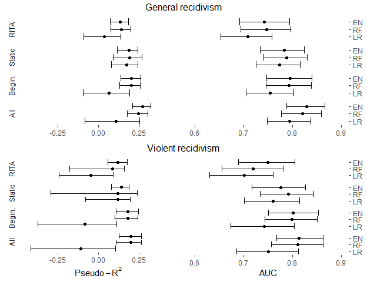

Reproducing Figure 1
================
Benny Salo
2019-04-03

This vignette reproduces Figure 1 in the article.

``` r
library(recidivismsl)
library(dplyr)
library(ggplot2)
```

Create a data frame with median and 95% percintile confidence intervals for AUC.

``` r
# Functions from dplyr used (select, mutate, group_by, summarise)
auc_tbl_cv <-
  model_perfs_training_set1000$values %>% 
  select(Resample, ends_with(match = "ROC")) %>% 
  tidyr::gather(-Resample, key = model, value = ROC) %>%
  group_by(model) %>% 
  summarise(median_auc_cv = median(ROC),
            ci95_LL_cv    = quantile(ROC, probs = 0.025),
            ci95_UL_cv    = quantile(ROC, probs = 0.975)) %>% 
  # Remove ~ROC from the end of the model name
  mutate(model = stringr::str_replace(model, pattern = "~ROC", ""))
```

Create a data frame with median and 95% percintile confidence intervals for McFaddens Pseudo R2.

``` r

McF_tbl_cv <-
model_perfs_training_set1000$values %>% 
  select(Resample, ends_with(match = "McF_R2")) %>% 
  tidyr::gather(-Resample, key = model, value = McF_R2) %>%
  # mutate(logit_R2 = log(McF_R2 / (1-McF_R2))) %>% 
  group_by(model) %>% 
  summarise(median_McF_R2 = median(McF_R2),
            ci95_LL_R2    = quantile(McF_R2, probs = 0.025),
            ci95_UL_R2   = quantile(McF_R2, probs = 0.975)) %>% 
  # # Remove the column `mean_logit` 
  # select(-mean_logit) %>% 
  # Remove ~ROC from the end of the model name
  mutate(model = stringr::str_replace(model, pattern = "~McF_R2", ""))
```

Get some model descriptions for `model_grid` and join this with the two results tables above into `plot_data`

``` r
model_desc <- model_grid[c("model_name", "outcome", 
                           "predictors", "model_type")]


plot_data <- full_join(McF_tbl_cv, auc_tbl_cv, by = "model") %>% 
  full_join(model_desc, plot_data, by = c("model" = "model_name"))
```

Limit `plot_data` to the "Main analyses" (exclude analyses of single dimensions using logistic regression). The apply levels that will appear in the figure.

``` r
main_models <- model_grid %>% 
  filter(analysis == "Main analyses") %>% 
  .[["model_name"]]


plot_data <- 
  filter(plot_data, model %in% main_models) %>% 
  mutate(predictors = factor(predictors,
                             levels = c("Rita-items",
                                           "Static",
                                           "All at start of sentence",
                                           "All including term"),
                             labels = c("RITA", "Static", "Begin.", "All")),
         model_type = factor(model_type,
                             levels = c("Logistic regression",
                                        "Random forest",
                                        "Elastic net"),
                             labels = c("LR", "RF", "EN")))

levels(plot_data$model_type)
#> [1] "LR" "RF" "EN"
```

Set up limits that will be used on axes in the figure.

``` r
McF_limits <- c(-0.45, 0.45)
AUC_limits <- c(0.6, 0.9)
```

Do the actual plotting. Begin by making plots for general recidivism. First make separete plots for McFadden Pseudo R-Squared and AUC and then combine them.

``` r
library(ggplot2)

plot_data_gen <-
  filter(plot_data, outcome == "General recidivism") 

McF_gen_plot <- 
  ggplot(plot_data_gen, aes(y = median_McF_R2, 
                            ymin = ci95_LL_R2,
                            ymax = ci95_UL_R2,
                            x = model_type))  +
  geom_point() + 
  geom_errorbar() + 
  coord_flip() +
  scale_x_discrete(breaks = NULL) +
  scale_y_continuous(limits = McF_limits) +
  facet_grid(rows = vars(predictors), switch = "y") +
  ggthemes::theme_tufte(base_family = "sans") +
  xlab(NULL) +
  ylab(NULL)

AUC_gen_plot <- 
  ggplot(plot_data_gen, aes(y = median_auc_cv,
                            ymin = ci95_LL_cv,
                            ymax = ci95_UL_cv,
                            x = model_type))  +
  geom_point() +
  geom_errorbar() + 
  coord_flip() +
  scale_x_discrete(position = "top") +
  scale_y_continuous(limits = AUC_limits) +
  facet_grid(rows = vars(predictors)) +
  xlab(NULL) +
  ylab(NULL) +
  ggthemes::theme_tufte(base_family = "sans") +
  theme(strip.text.y = element_blank())


gen_plot <- ggpubr::ggarrange(McF_gen_plot, AUC_gen_plot,ncol = 2, nrow = 1)
gen_plot <- ggpubr::annotate_figure(gen_plot, top = "General recidivism")
  
```

Do the same for violent recidivism.

``` r

plot_data_vio <-
  filter(plot_data, outcome == "Violent recidivism") 

McF_vio_plot <- 
    ggplot(plot_data_vio, aes(y = median_McF_R2, 
                            ymin = ci95_LL_R2,
                            ymax = ci95_UL_R2,
                            x = model_type))  +
  geom_point() + geom_errorbar() + 
  coord_flip() +
  scale_x_discrete(breaks = NULL) +
  scale_y_continuous(limits = McF_limits) +
  facet_grid(rows = vars(predictors), switch = "y") +
  ggthemes::theme_tufte(base_family = "sans") +
  xlab(NULL) +
  ylab(bquote(Pseudo-R^2))

AUC_vio_plot <- 
  ggplot(plot_data_vio, aes(y = median_auc_cv,
                            ymin = ci95_LL_cv,
                            ymax = ci95_UL_cv,
                            x = model_type))  +
  geom_point() + geom_errorbar() + 
  coord_flip() +
  scale_x_discrete(position = "top") +
  scale_y_continuous(limits = AUC_limits) +
  facet_grid(rows = vars(predictors)) +
  xlab(NULL) +
  ylab("AUC") +
  ggthemes::theme_tufte(base_family = "sans") +
  theme(strip.text.y = element_blank())

vio_plot <- ggpubr::ggarrange(McF_vio_plot, AUC_vio_plot, ncol = 2, nrow = 1) 
vio_plot <- ggpubr::annotate_figure(vio_plot, top = "Violent recidivism")
  
```

Combine the two plots.

``` r
comb_plot <- ggpubr::ggarrange(gen_plot, vio_plot, ncol = 1, nrow = 2)

comb_plot
```


