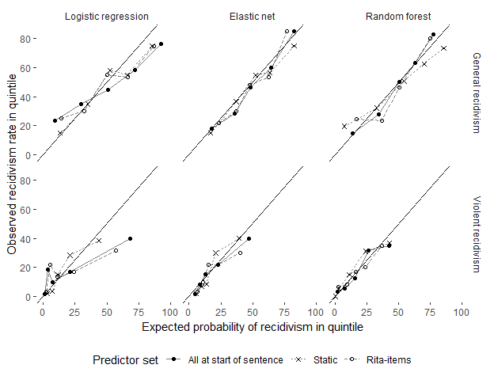

Figure 2 - Calibration
================
Benny Salo
2019-04-05

This vingette reproduces Figure 2 in the article: a calibration plot. It uses the data object `test_set_predictions`.

Setup
-----

``` r
rm(list = ls())
library(recidivismsl)
library(dplyr)
```

We only want to plot calibration of the main analyses (not the logistic regression models with only a single RITA-factors as a predictor.)

``` r
test_set_predictions_mains <- 
  select(test_set_predictions, 1:3, model_names_main)
```

Calculating expected and observed outcomes by quintile will be facilitated by having a separate data frame for each model including the estimated probabilities, corresponding quintile, and pertinent outcome.

We start by making a list vectors of estimated probabilities that we then turn to a list of data frames - at this point with a single column.

``` r
gen_models <- stringr::str_subset(names(test_set_predictions_mains), "^gen_")
vio_models <- stringr::str_subset(names(test_set_predictions_mains), "^vio_")

model_df_list <- as.list(test_set_predictions_mains[c(gen_models, vio_models)])

model_df_list <- purrr::map(model_df_list,
                            .f = ~ data_frame(prediction = .x))
```

For each data frame we add a column with the corresponding quintile

``` r
# Function to use
make_quintiles <- function(x) {
  quint_breaks <- (quantile(x, probs = seq(0, 1, 0.2)))
  quintiles    <- cut(x, 
                      breaks = quint_breaks, 
                      include.lowest = TRUE, 
                      labels = FALSE)
  return(quintiles)
}

model_df_list <- 
  purrr::map(.x = model_df_list,
             .f = ~ mutate(.x, quintile = make_quintiles(prediction)))
```

We the add the pertinent outcome variable

``` r
# Split into seperate lists for general and violent recidivism
model_df_list_gen <- 
  purrr::map(.x = model_df_list[gen_models],
             .f = ~cbind(.x, outcome = test_set_predictions_mains$reoffenceThisTerm))

model_df_list_vio <- 
  purrr::map(.x = model_df_list[vio_models],
             .f = ~cbind(.x, outcome = test_set_predictions_mains$newO_violent))

# Combine back
model_df_list <- c(model_df_list_gen, model_df_list_vio)
```

Assertions

``` r
# All data frames have 3 colmns
stopifnot(all(purrr::map(model_df_list, length) == 3))
# All models are included (and nothing else)
stopifnot(all(sort(c(vio_models, gen_models)) == 
                  sort(names(model_df_list))))
# Columns in data frame have the expected names
list_of_column_names <- purrr::map(model_df_list, names)
stopifnot(all(
  purrr::map_lgl(.x = list_of_column_names,
                 .f = ~ identical(.x, c("prediction", "quintile", "outcome")))
  ))
```

For each data frame we calculate the expected and observed recidivism rates. We get a list of data frames with 5 rows (one per quintile) and three columns (quintile, observed rate and expected rate.)

``` r
# Function to use. 
get_rates_per_bin <- function(model_data_frame) {
  model_data_frame %>% 
    group_by(quintile) %>% 
    summarise(n = n(),                              # n in quintile
              obs = sum(as.numeric(outcome) == 2),  # number of reoffences
              obs_rate = obs/n * 100,               # observed rate
              exp_rate = mean(prediction)*100) %>%  # expected rate
    select(-n, -obs)   # remove intermediate steps
}

calibration_list <- purrr::map(model_df_list, get_rates_per_bin)
```

Now we bind together all the data frames and create an identifying label with the model name. This results in a data frame with four columns and 24 models x 5 quintiles = 120 rows.

``` r
calibration_dframe <- bind_rows(calibration_list, .id = "model_name")

stopifnot(ncol(calibration_dframe) == 4)
stopifnot(nrow(calibration_dframe) == 120)
```

We also want the descriptions of the models that we can take from `model_grid`

``` r
model_desc <- model_grid[c("model_name", "outcome", "predictors", "model_type")]
calibration_dframe <- left_join(calibration_dframe, model_desc, by = "model_name")
```

With this we can make a plot.

``` r
library(ggplot2)

calibration_plot <-
calibration_dframe %>% 
  filter(predictors != "All including term") %>% 
  ggplot(aes(x = exp_rate, y = obs_rate, group = predictors)) +
  geom_line(aes(lty = predictors), alpha = 0.5) +
  geom_point(aes(shape = predictors)) +
  geom_abline() +
  scale_linetype(name   = "Predictor set") +
  scale_shape_manual(values = c(16, 4, 1, 17),
                     name   = "Predictor set") +
  scale_x_continuous(limits = c(0, 100)) +
  facet_grid(outcome ~ model_type) +
  ylab("Observed recidivism rate in quintile") +
  xlab("Expected probability of recidivism in quintile") +
  ggthemes::theme_tufte(base_family = "sans") +
  theme(legend.position = "bottom")
  

  calibration_plot
```


